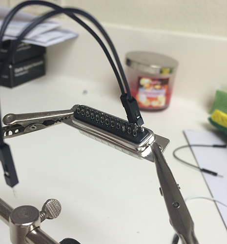
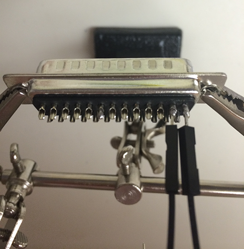
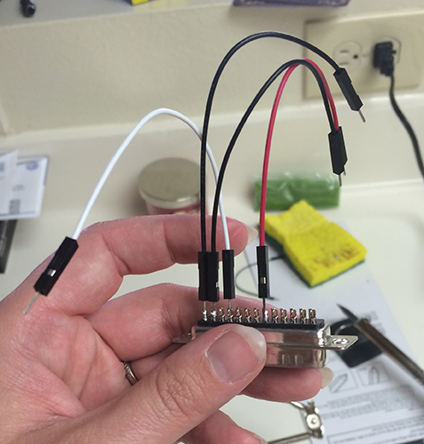
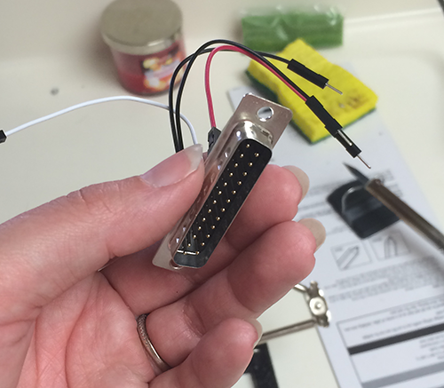
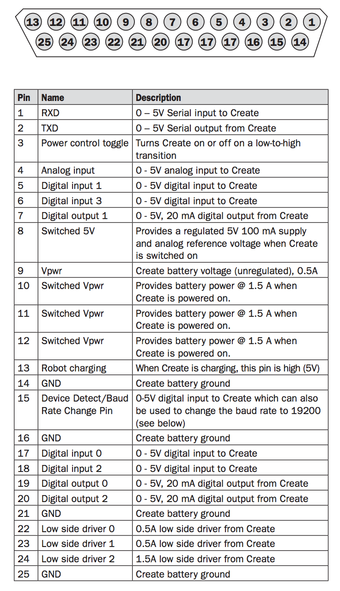
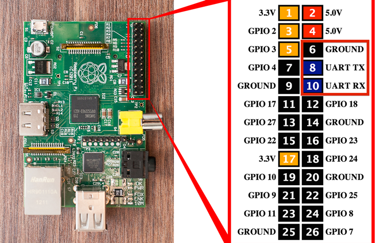
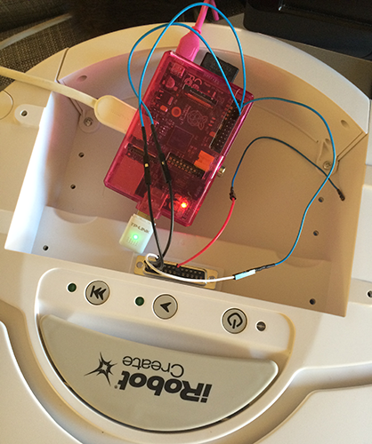

### Making connections

Web to Radio Shack and bought a 25-pin male serial solder connector, to plug directly into the Create's Cargo Bay Connector. I then soldered 4 jumper cables to the connector, for data, ground, and power.

Leaving the power off for now (and the RPi plugged into AC power) to test, I connected the other three cables to the RPi's GPIO pins for ground, UART TX, and UART RX.

The RPi connected to the Create, currently only plugged into AC power, with no display or USB hub:

