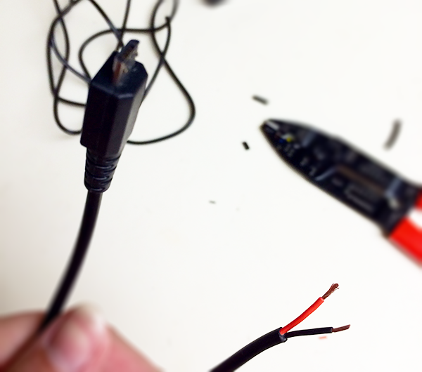
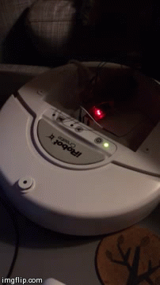

### He's alive!

So this morning I made my own power cable! Well, to be more exact, I frankensteined a micro USB power cable together, that now draws power from the Create's Cargo Bay Connector to the RPi.

I had originally thought I could use jumper cables from the Cargo Bay Connector's 5V pin directly to the RPi's GPIO pins, but after doing <a href=""http://raspberrypi.stackexchange.com/questions/1617/how-do-i-supply-power-through-the-gpio">more research</a>, it seems powering the RPi via the pins is not recommended/safe. While the GPIO pins can take 5V and power the RPi, the input is not buffered like the micro USB power is, or intended to be used as the Pi's primarly power. So if there is a spike, potentially dead Pi.

So that being said, I made a cable that would use the micro USB power and huzzah:

Yes, this video is kinda dark. This was at 4am mind you, my husband was asleep! But that green light blinking on the Create means data is going from it to the RPi! And that green light blinking on the RPi is the Wifi adapter doing it's job.**

Now, another observation I've noticed looking at similar projects: while most people power their RPi via the Cargo Bay Connector or a battery pack, about 99% still use the 7-pin serial on the side for data. Looking over the Create's pinout, it seems the 25-pin serial in the cargo bay has all the same inputs and capabilities as the 7-pin, and then some! So why not use that, instead of getting a serial to USB adapter for the RPi?

After an hour of trying to read data from those pins, I think I might be making another trip to Frys....

**Note: its seems I was a bit [over zealous](27.md).
