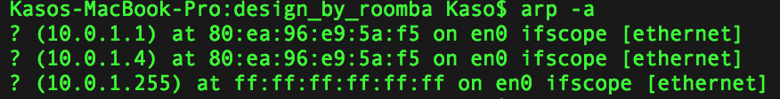
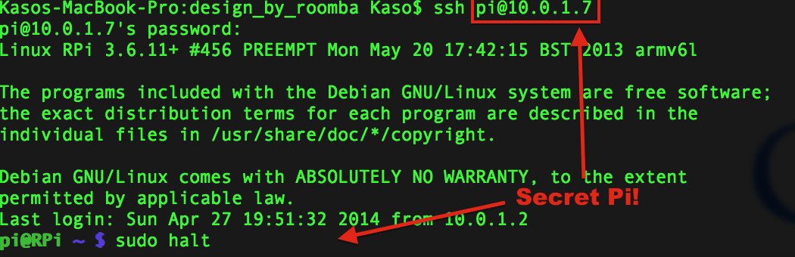

### Electronics

Spent ALL day yesterday failing to build a 5V/1A regulator... and cursing. I came home earlier in the week to find my Pi and Create dead, after thinking I had [solved my power issue](21.md). Turns out I had not.

The 5V battery power pin I was using on the Create is regulated (good), but its only ~0.5A, too low for the Pi. The RPi will run for a time, but then shut down. The other power pins are unregulated 10-12V (bad) at 1.5A (good). So I needed to build a 5V/1A regulator, which seemed easy enough judging from this <a href="https://www.youtube.com/watch?v=GSzVs7_aW-Y">YouTube video</a>.

I took another trip to Fry's (might as well surrender my paycheck to them each week), and bought:

 - 1x ~~5V 1A regulator~~**
 - 2x 10uF capacitor
 
**Edit: Apparently, what I thought was a regulator was actually an <a href="http://www.newark.com/nte-electronics/nte198/transistor-bipolar-npn-400v-30a/dp/76R0916">transistor</a>. Driving back to Frys to return it and actually get a <a href="http://www.radioshack.com/product/index.jsp?productId=2062599">regulator</a>. Thanks Martin ;)

### Success!

With the new regulator in place, the output is a regulated ~4.9V:

This is the low end of what a RPi needs, but works:

But now we have a new problem: the wifi dongle is not working, or even lit up. It seems this isn't enough power for both.
Also: this regulator needs a heat sink! After driving over to Radio Shack:

Better, the wifi dongle's light is on, but its not coming on the network...

### Frustrations

The RPi's IP (10.x.x.7) is not in the list of devices currently connected; despite the wifi adapter's light being green and flickering, indicating network communication. I assume maybe the RPi's IP address has changed, and I try to SSH into the one other IP listed (that isn't my own laptop): no go. The power should be enough, but with no display attached, I cannot be sure. Since it's not on the network, I cannot SSH in to check things out. 

<strong>Theory #1: Amps too low</strong>

I need a voltage regulator that does +5V/2A; drive back to Frys. I pick up the new, beefier regulator (<a href="http://www.nteinc.com/specs/1900to1999/pdf/nte1934.pdf">NTE1934</a>), and another, larger heatsink. After putting this all together, I have LESS power, not more. Specifically, I cannot seem to get above 1V out.

<strong>Theory #2: Ethernet connection</strong>

Perhaps the wifi dongle isn't working, and maybe with a direct ethernet connection, I can at least SSH in and see what is going on. but once the RPi is plugged into my router and rebooted, same deal:

I finally give up, plug everything back in (USB hub, wall AC power, keyboard/mouse, and monitor) to see what the heck is going on. Much to my surprise, I find the RPi has not been given a new IP, its still on the same one. I check the list of IP's currently on the network from my laptop, still no 10.x.x.7 listed, but I am looking at it on the RPi's display! I try to SSH into it from my laptop, and...

What the heck?! I shutdown the Pi, unplug everything, connect the Pi back up to the Create and turn it on again. After waiting for it the lights to come back up, I attempt to SSH in again, headless; and I get in. Even though the Pi isn't listed on the network, it was there the whole time!
