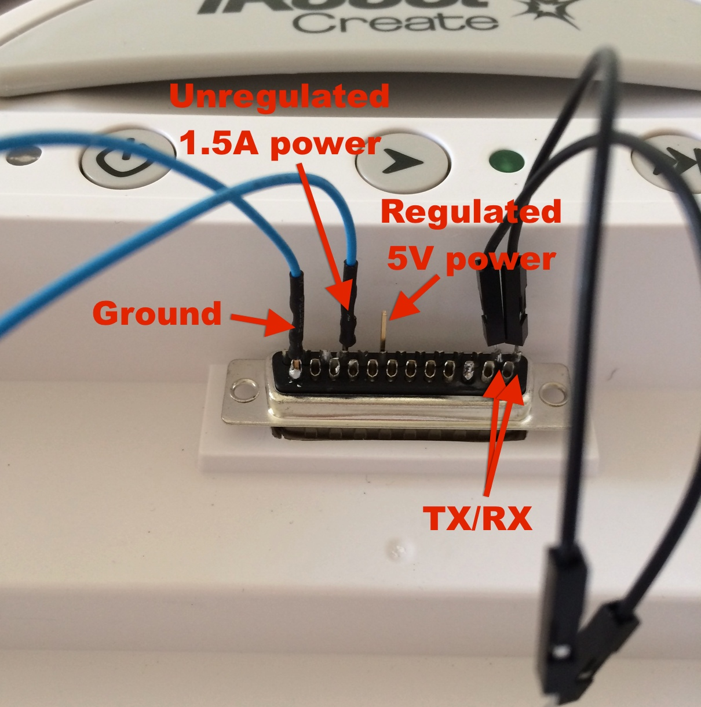
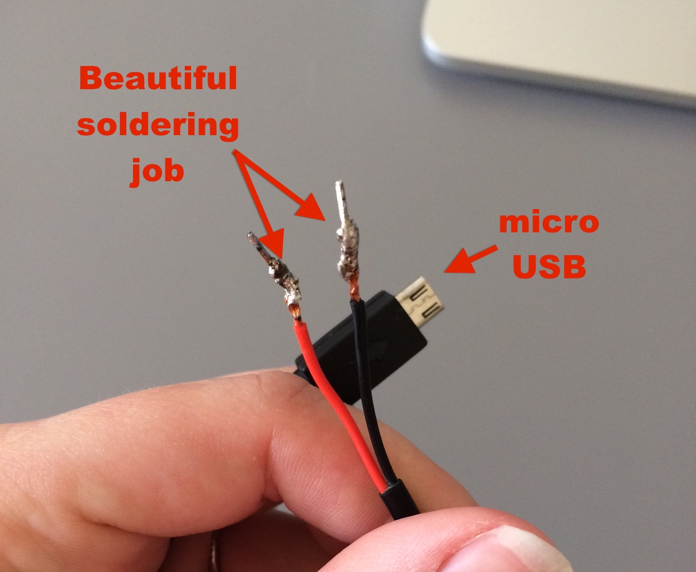
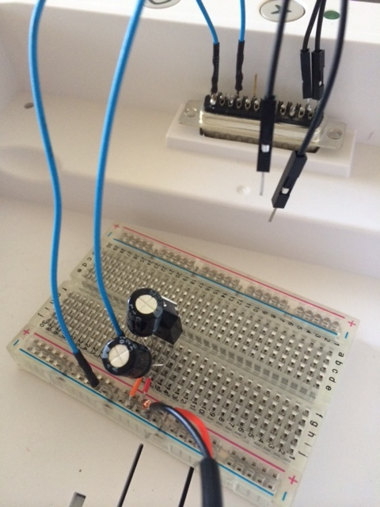
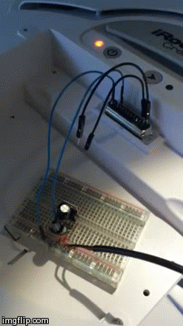
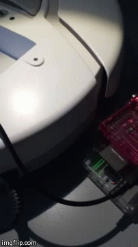
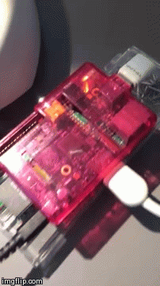
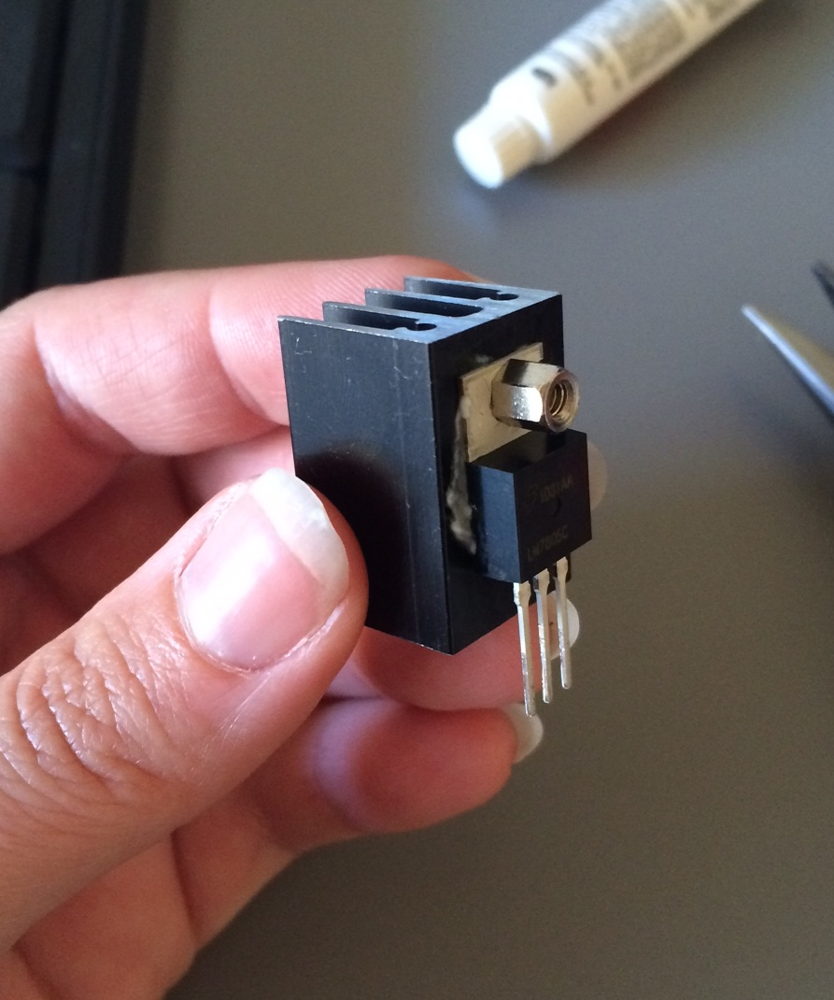

### Electronics

Spent ALL day yesterday failing to build a 5V/1A regulator... and cursing. I came home earlier in the week to find my Pi and Create dead, after thinking I had [solved my power issue](21.md). Turns out I had not.

The 5V battery power pin I was using on the Create is regulated (good), but its only ~0.5A, too low for the Pi. The RPi will run for a time, but then shut down. The other power pins are unregulated 10-12V (bad) at 1.5A (good). So I needed to build a 5V/1A regulator, which seemed easy enough judging from this <a href="https://www.youtube.com/watch?v=GSzVs7_aW-Y">YouTube video</a>.

I took another trip to Fry's (might as well surrender my paycheck to them each week), and bought:

 - 1x ~~5V 1A regulator~~**
 - 2x 10uF capacitor
 
**Edit: Apparently, what I thought was a regulator was actually an <a href="http://www.newark.com/nte-electronics/nte198/transistor-bipolar-npn-400v-30a/dp/76R0916">transistor</a>. Driving back to Frys to return it and actually get a <a href="http://www.radioshack.com/product/index.jsp?productId=2062599">regulator</a>. Thanks Martin ;)

### Success!

With the new regulator in place, the output is a regulated ~4.9V:

This is the low end of what a RPi needs, but works:

But now we have a new problem: the wifi dongle is not working, or even lit up. It seems this isn't enough power for both.
Also: this regulator needs a heat sink! After driving over to Radio Shack:

Better, the wifi dongle's light is on, but its not coming on the network...
