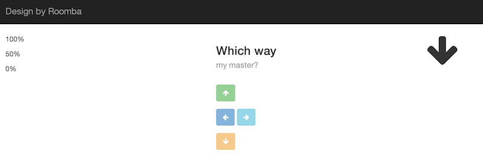
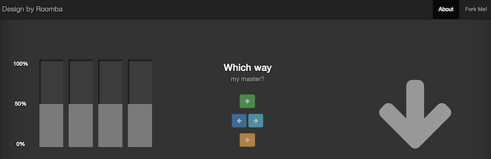
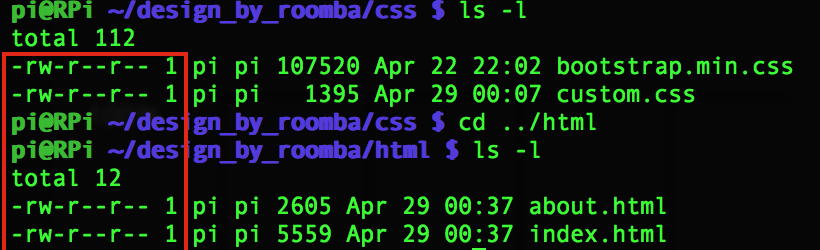
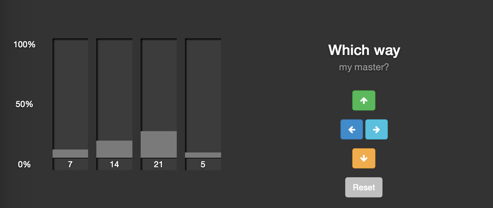

### Design Issues

After confirming that everything was working with the Pi connected and running off the Create, I pulled down the latest files to the Pi, and redirected the webserver to host them. A new surprise, the CSS was not rendering correctly on the Pi's webserver.

This is what it looks like. 

This is what it <em>should</em> look like. 

I confirmed that the CSS link was valid in the HTML, and that all the file permissions were correct on the pi:

After reading a little more into <a href="https://code.google.com/p/webiopi/">Webiopi</a>, I think I'll need to go with <a href="http://www.penguintutor.com/linux/light-webserver">Lighttpd</a>.

After updating the Pi's installer, I gave the [Pi a static IP](http://weworkweplay.com/play/automatically-connect-a-raspberry-pi-to-a-wifi-network/), installed Lighttpd and PHP5. I then made an index.php file in /var/www with:

    <?php echo 'Hello World'; ?>
    
This confirmed PHP was running.

### Voting

Wrote up the PHP to increment button presses and read them back as votes, while increasing the bar graph in real time. Not sure if I want to leave the values as the actual number, or convert to percentages, so the bar graph is always 100% across all votes, and resizes accordingly. Will have to try both and see.

[Back](27.md) | [Next](29.md)
