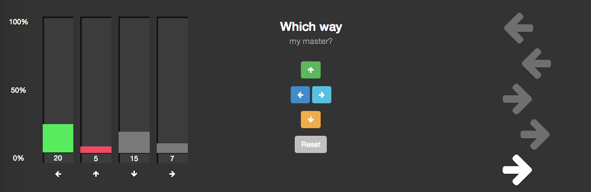

### Design Decisions

Got some spiffy 'Dance, Dance' action going; correlating with the 5 most recent directions in the click history (being saved to a txt file).

Tested out the bar graph percentage idea, and decided I didn't like it. The bars would grow and shrink as votes were tallied. I like the idea of the bars only going up, not down, when voting is happening.

Also added colors to the graph, based on the highest (winning) and lowest (losing) directions.

Note to self: <http://www.linuxjournal.com/magazine/fun-irobot-create>

[Back](28.md)
