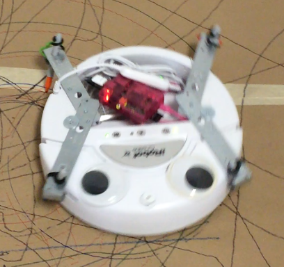

### Last day before the big show!

Every video player solution I tried to run on the second Pi, running Raspbian, did not work.
Then it occured to me: why am I not running a media player OS like [Raspbmc](http://wiki.xbmc.org/?title=Raspbmc)?

I reformat the second Pi's SD card and install ~~Raspbmc~~ [OpenElec](http://openelec.tv/).
Got videos looping in a playlist from the USB drive, now I just need more videos.

Had more network issues, connecting, staying connected, getting a static IP, etc. Could not get a static IP from the school's network, will just have to work around it by connecting the pi to a display and manually connecting first.

Currently, my /etc/network/interfaces files:
```
auto lo

iface lo inet loopback
iface eth0 inet dhcp

allow-hotplug wlan0
iface wlan0 inet manual
wpa-roam /etc/wpa_supplicant/wpa_supplicant.conf
iface default inet dhcp
```

And was able to solve my drawing problem with 4 arms and Sharpies. RossBot looks more like a BattleBot now:



Still am not able to read sensor data from the Create in order to act on bumps, but with the 4 arms, I'm now blocking the front bumpers anyways.

Everything aside, RossBot works!

<a href="https://www.youtube.com/watch?v=6hlN1Cl-t8U&feature=youtu.be"></a>

[Back](8.md)
