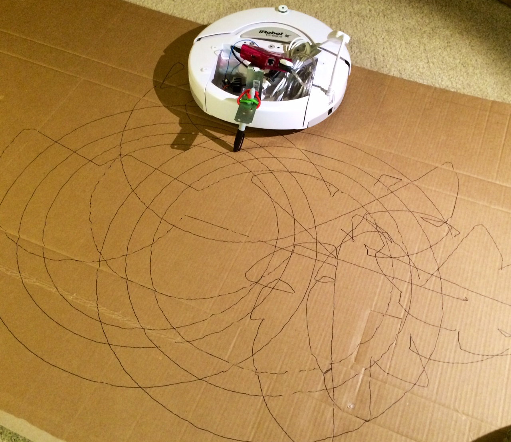

#### Drawing things!

Testing out both the hardware hack to hold the Sharpie behind the Create on cardboard. The Create is running through it's native/built-in driving mode, where it spirals outward until hitting something. The pen stayed in despite the cardboard being fairly bumpy. Will need to try a different pen, and a different surface next.

[Back]() | [Next]()

