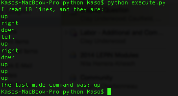

### Finally, a break through!

Just when I was beginning to think I would never understand this iRobot interface and get this working, I found the most helpful documentation ever:

<http://www.cs.gmu.edu/~zduric/cs101/pmwiki.php/Main/Installation>

An upper division CS course at GMU teachs students how to create and operate iRobot Creates, but more importantly, they made a fantastic create.py script and documentation! This was the bridge I was looking for, to make the connection between Create's serial interface and the RPi.

Still utilizing Pyserial, copy this [create.py](../../../../gh-pages/python/create.py) script in the "/dev" directory of your RPi (adjacent the Serial directory), and write your Python script importing the two:

```python
import serial;
import create;

robot = create.Create("/dev/ttyUSB0");

```
A full API doc, explaining each method and its possible parameters, can be found here:

<http://www.cs.gmu.edu/~zduric/cs101/pmwiki.php/Main/APITutorial>

Video proof of the [little test script I wrote](../../../../gh-pages/python/test2.py), uploaded to the RPi, and then ran remotely:

<https://www.youtube.com/watch?v=RIA5MStBmr0&feature=youtu.be>

Also: I found this amazing Python script to make your Roomba or Create [sing the Imperial March](https://gist.github.com/thenoviceoof/5465084), care of [thenoviceof](https://github.com/thenoviceoof).

### Formulating a plan

So I've never had to read or write to a file in Python. Reading up on [Python's Input and Output methods](https://docs.python.org/2/tutorial/inputoutput.html#reading-and-writing-files), and was able to read in the text files written by the PHP page:



Getting closer....

[Back](10.md)
