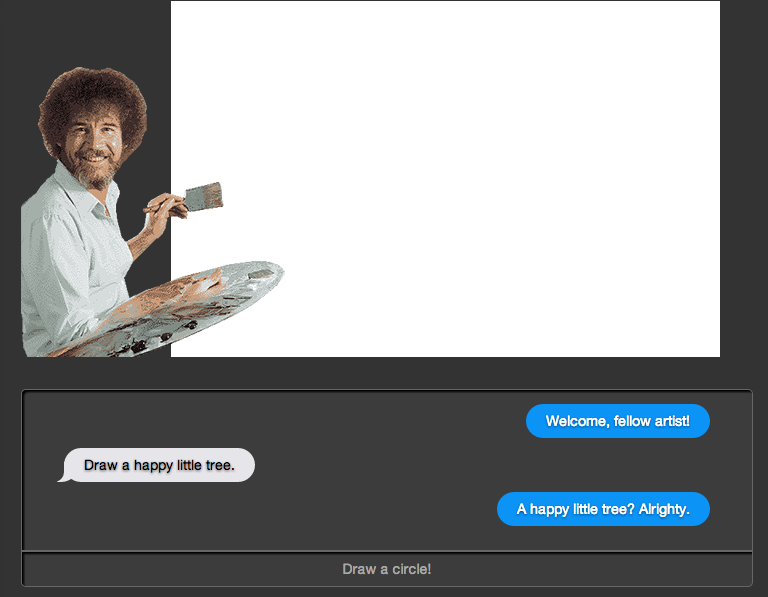
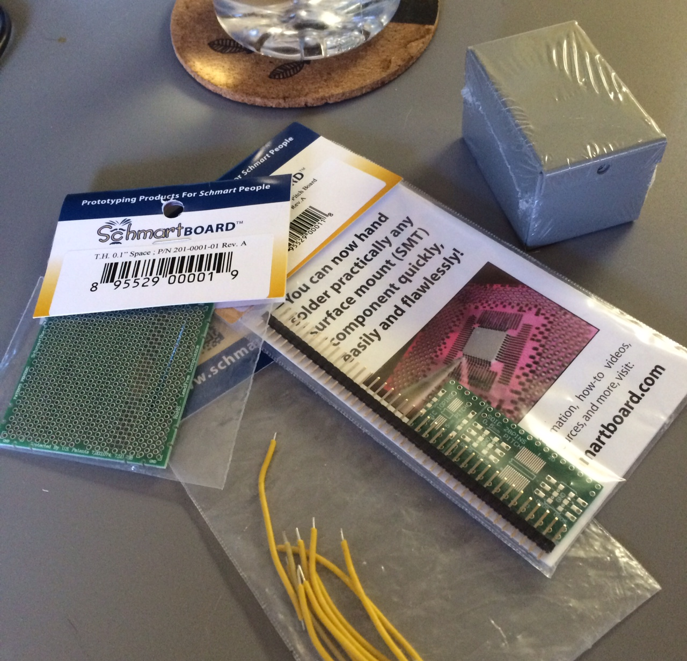
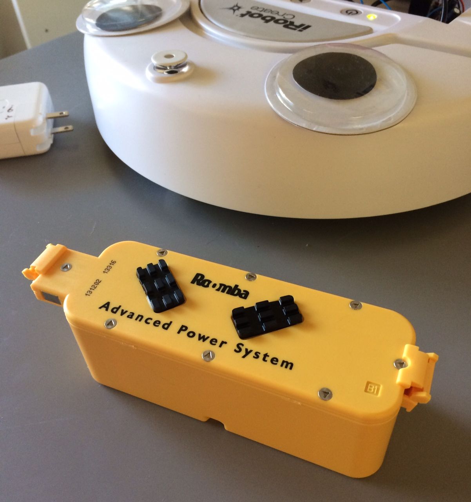

### RossBot

Going full steam with the Bob Ross theme, the new interface begins to take shape:

I've left the previous interface intact, and started this as a separate "mode", that user's can flip between. This new mode will introduce a few changes to the mechanic:

 - Commands the Create takes are simple shapes, as opposed to basic directions.
 - Commands are given via full-text chat with the Create, where specific keywords are parsed out and used as commands.
 - Create talks back, in text, in a Bob Ross-like persona.
 - Text conversation is written to a text file on the server, and displayed in an iOS-like interface window.
 - Picture thus far is also drawn on a canvas on the page, above the text transcript. Something like [this](http://mason.gmu.edu/~hiankov/projects/VR.html).
 
Hopefully that last part won't cause too many problems...

### Shopping

Got new parts and began building a permenent 5V regulator (instead of a breadboard prototype):

And also, the super-duper-extended battery I ordered came:

[Back](12.md) | [Next](18.md)
