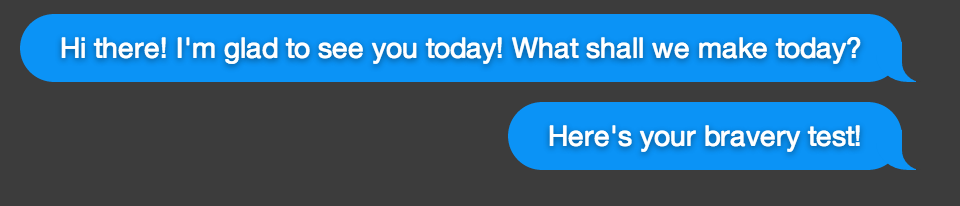
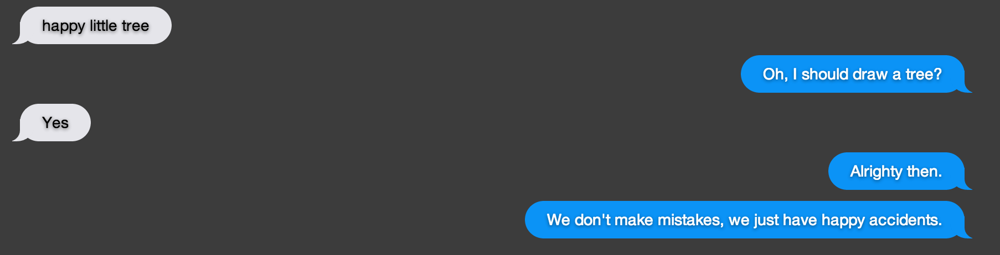

### Bob Ross speaks!

Improved the Bob Ross Mode with better chat features:

 - If no there's record of a conversation, introduce yourself, say a random Bob Ross quote:
 
 
 
 - When the user enters something in, parse it, compare against predetermined keywords, and then respond with a confirmation.
 - If last user response contains "no", then carry on.
 - If last user response contains "yes", confirm and execute, also giving another random Bob Ross quote:
  
 
 
[Back](15.md)
