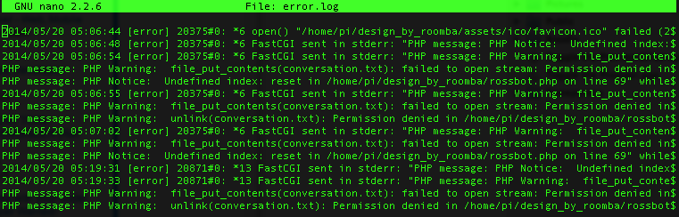

### Web forms

Doing some research on web forms, specifically in relation to the RPi:

 - [CGI Scripting on the RPi](http://raspberrywebserver.com/cgiscripting/)
   - [Sending data via HTTP GET & POST](http://raspberrywebserver.com/cgiscripting/sending-data-to-an-HTTP-server-get-and-post-methods.html)
 - [Nginx webserver](http://elinux.org/RPi_Nginx_Webserver)
   - [More Nginx setup...](http://www.ducky-pond.com/posts/2013/Sep/setup-a-web-server-on-rpi/)
 - [Web forms in Python](http://raspberrywebserver.com/cgiscripting/web-forms-with-python.html)
 - [RPi LAMP stack](http://www.php5dp.com/get-mysql-and-php-to-work-together-in-raspberry-pi/)
 
I REALLY was not expecting the PHP form submissions to be a problem...at all. I have some work to do....

### Troubleshooting
Nginx fully installed and configured with PHP5, still no go. PHP page renders, submit does nothing.

Clearly lots of people are able to run webservers and PHP off the RPi, there are tutorials for days on the subject; what am I doing wrong?! After racking my brain, trying to figure out what it could be, I found [this post on the Raspberry Pi forums](http://www.raspberrypi.org/forums/viewtopic.php?f=36&t=76440&p=546159&hilit=webserver+php#p546159).

OF COURSE! I always forget how picky Unix/Linux is with file permissions, and it's always the last thing I check. I look up the Nginx error log, and sure enough...

I've never been so happy to see the words *Permission denied*! I'm not crazy or incompetent!

Note to self: Nginx error log is in /var/log/nginx/error.log

[Back](18.md)
