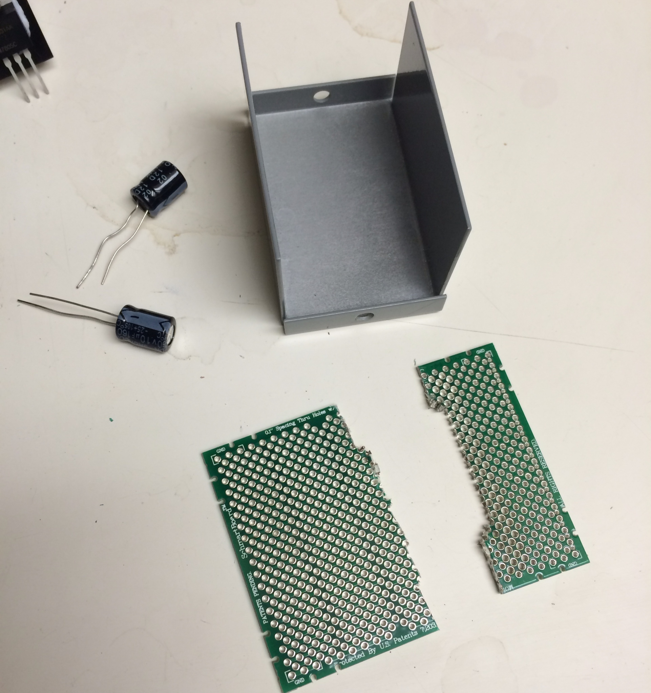
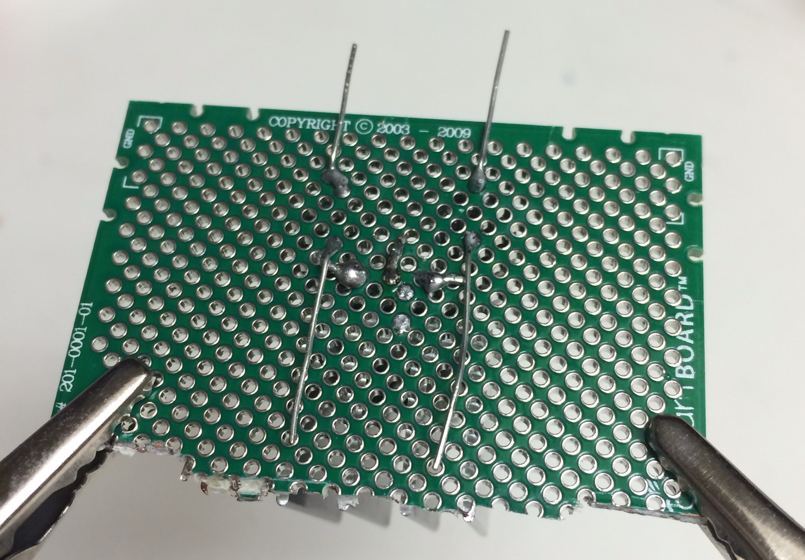
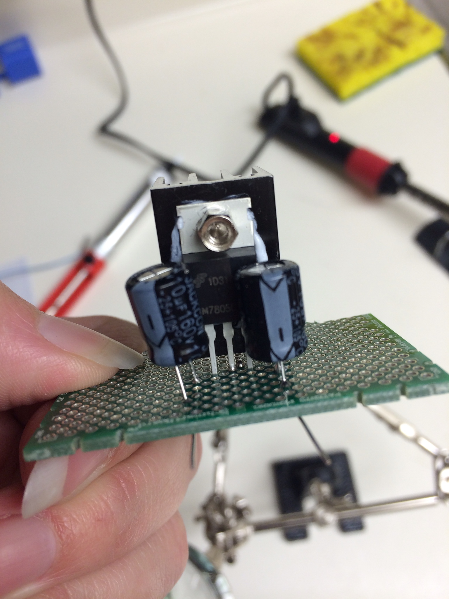
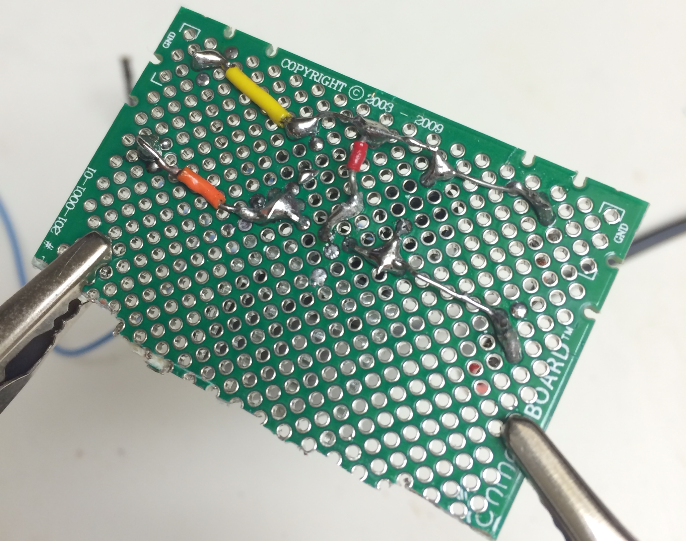
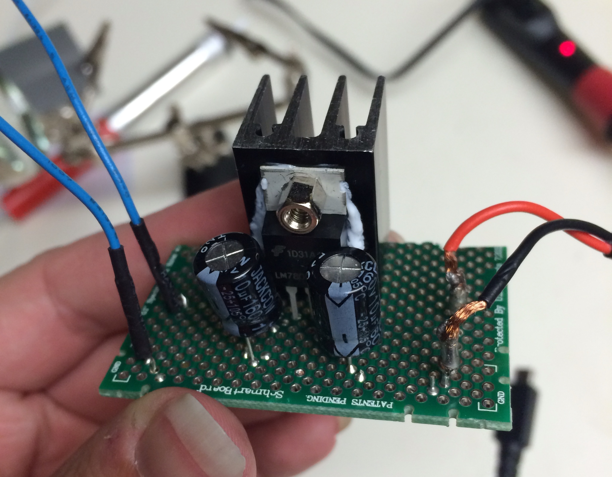
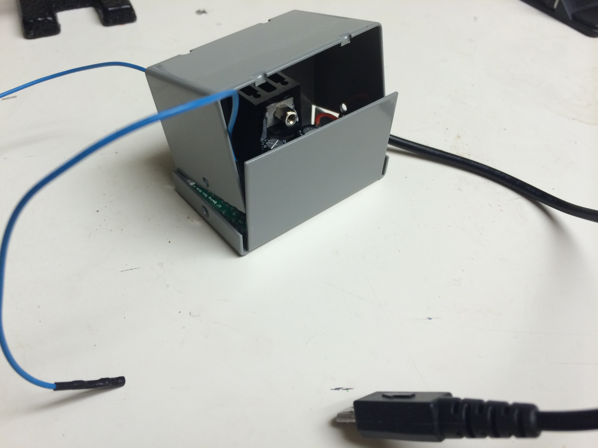

### Soldering fun

After cutting down my circuit board so it would fit into the project box I got, I soldered all the parts for the 5V regulator to the board. 

Kepp in mind, this is my first attempt at soldering components to a board. Ever.

But as always, there's a snag. After connecting it to the Create, who's LED immediately begins flickering rapidly, I get no volts out. Even stranger, despite the 5v power pin on the Create putting out ~17V normally, once the regulator is connected, that same input is now down to 1V, making the output nothing.

Boo.

[Back](22.md)

