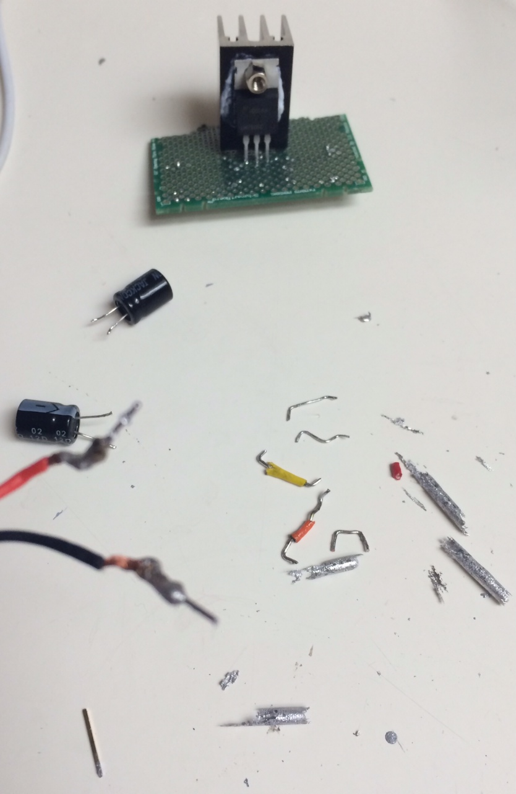

### MOAR soldering

Back to the drawing board, I take another swing at making this work.

After inspecting my joints, and not really knowing what to look for, I do some research into what bad soldering joints look like. And according to this [Adafruit soldering tutorial](https://learn.adafruit.com/adafruit-guide-excellent-soldering/tools), it looks like I got ALL the [common soldering problems](https://learn.adafruit.com/adafruit-guide-excellent-soldering/common-problems)!

I clean up the joints as best I can and hook it up again. Still the same.

[Back](24.md)
