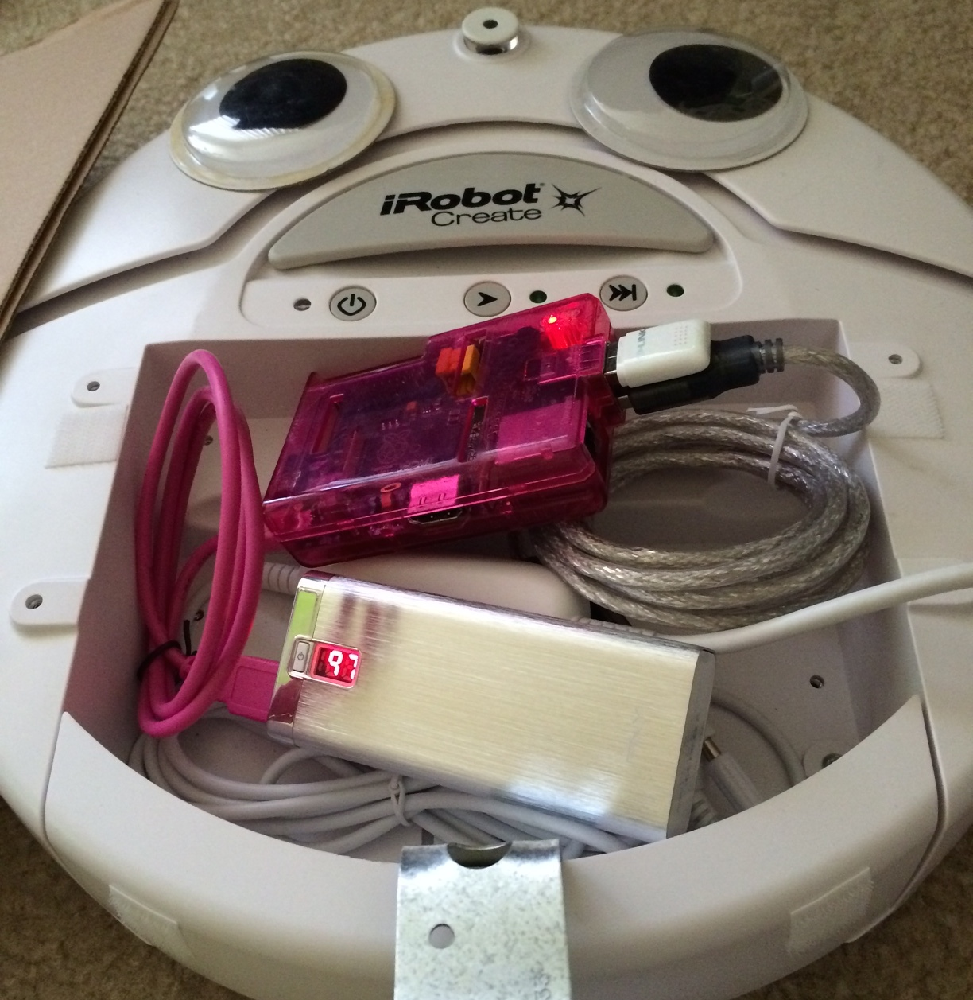

### Fine Tuning

Due to the battery drain issues, I purchased a separate battery pack (iPhone battery) to run the RPi off of. This solves 2 problems: the Create's battery isn't drained as fast, and I don't have to worry about the 5V regulator.

I also adjusted the PHP code so it would not try to confirm when it parses keywords, and also stores multiple keywords if multiple are found, and chains python scripts accordingly. This increases the initial delay (think time) when commands are first sent, and the delay between commands is the same. So for comparison:

| Shape | Dimensions (cm) | Init Time (s) | Time to Complete (s) |
|:-----:|:---------------:|:-------------:|:--------------------:|
|Square|45 x 45 | 2.5 | 17.6 |
|Triangle | 45 x 45 x 45 | 3 | 14.2 |
| Line | 45 | 2.7 | 2 |
| Circle | 22.5 radius | 5.3 | 6 |
| Square, circle, line | -- | 5.8, 4, 4.4 | 17.5, 5.6, 1.9|

[Back](28.md)
