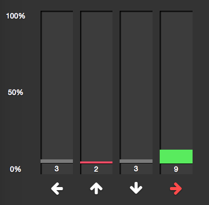
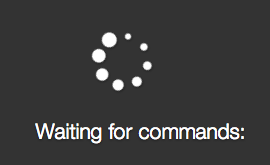

### Page updates!

Had a busy weekend, couldn't get a lot of time in on this, but made a few design tweaks to the page, mainly for UX:

- Added a check to see what the last button clicked was, and colors the graph labels accordingly...

- Added another check on the right side to see if the clicked.txt file has been reset, in which case we show a loading sign as opposed to nothing:

