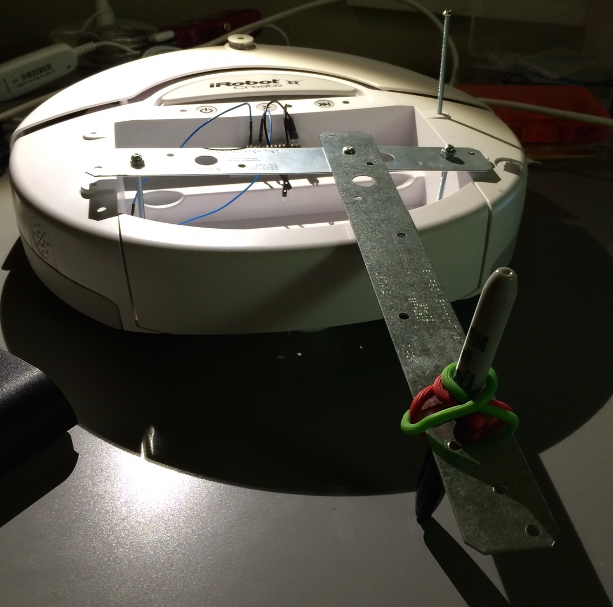
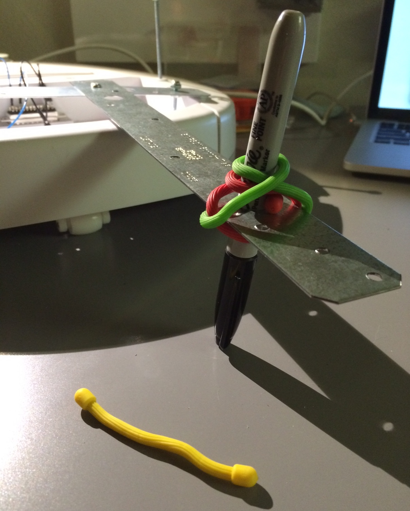
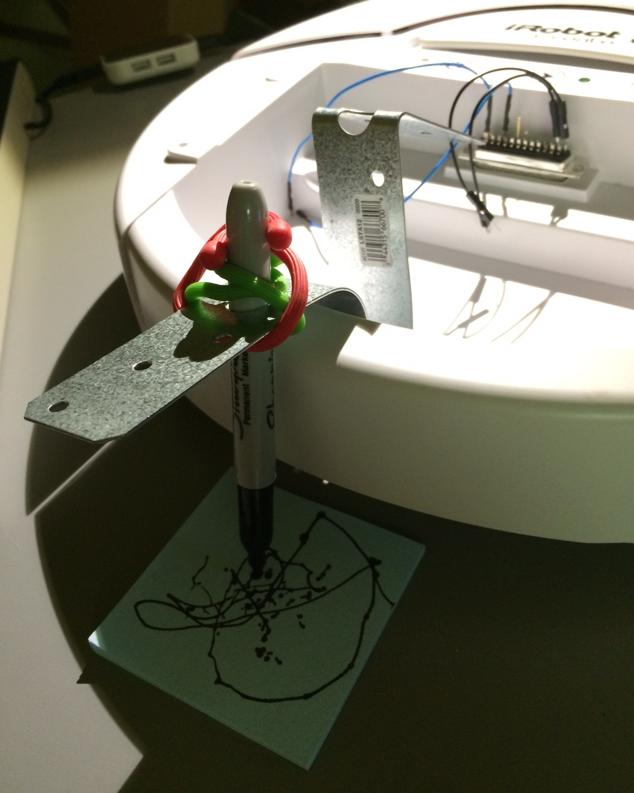
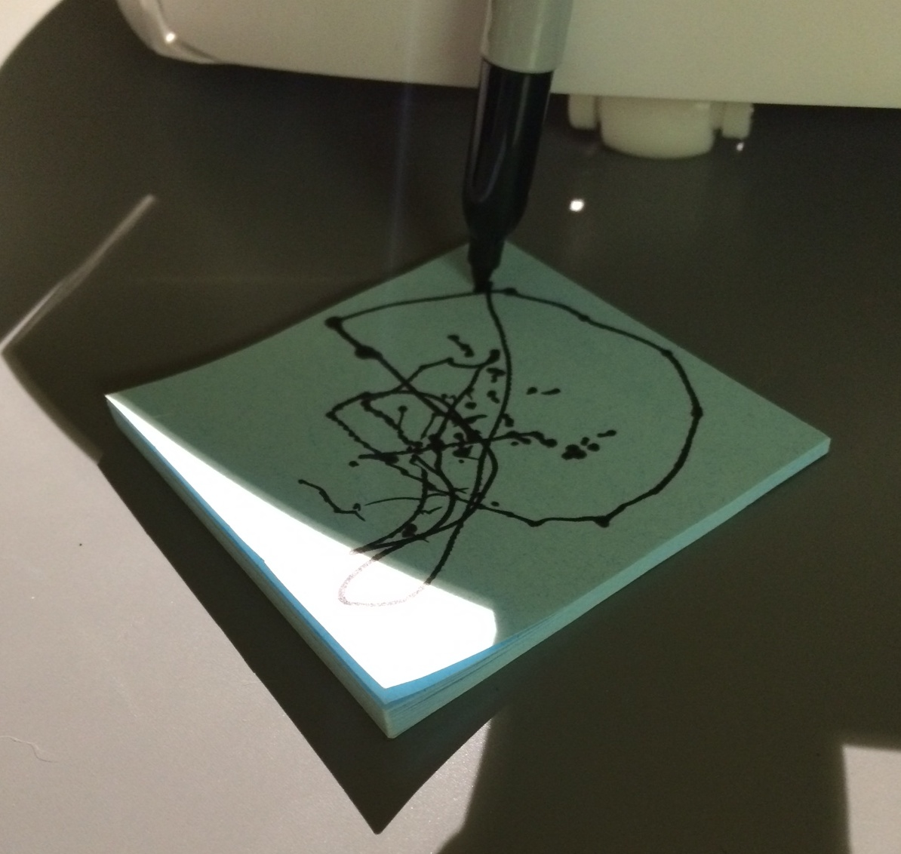

### Time Wasted

Spent 6 hours today trying to implement a JQuery timer. Yea, sounds easy; until I realized my PHP form constantly submitting and refreshing the page rendered the timer useless, since it was constantly being reset.

The idea was to give the users feedback as to how long they have to get votes in, with a dynamic timer counting down. But in order to do that, it needs to be in Javascript (client side). All my tallying and recording of votes, checks, and other feedback is in PHP (server side).

So I spent way too much time trying to rewrite all my code in Javascript, but it never really worked right. Plus, I realized, yet again, that the tallying and recording votes NEEDS to be on the server if I want it to work across multiple different IP's and have the same feedback.

Oh well. Ctrl Z. Ctrl Z. Ctrl Z...

#### Robot arms!

Picked up some scrap metal, nuts, bolts, and some bendy-rubber thingies from Home Depot to try to build a drawing arm onto the Create. I decided to attach the arm to the back, so that the Create would be dragging the pen behind it, since the mounting holes were in the back. This also leaves the front bumper free to be bumped.

I tried several different combinations, and though it is holding the Sharpie farily steady, I'm not sure this will be the final implementation. The bendy-rubber thingies I found have been super helpful, proving to be stronger than I thought, and holding the pen steady through directional changes.

[Back](4.md)
